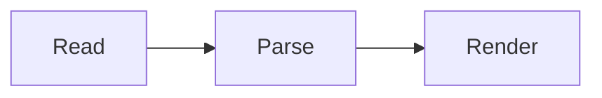
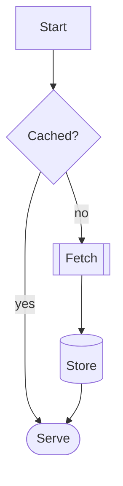
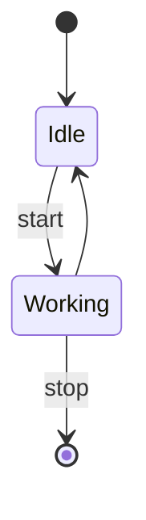
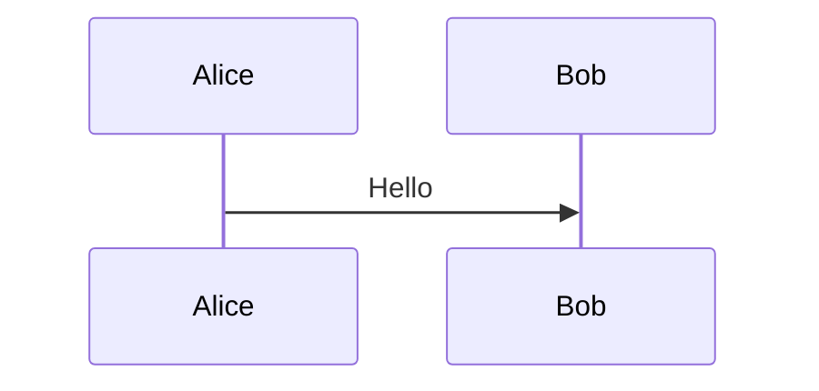

# Diagrams

A left-to-right flowchart.



A top-down flowchart with mixed shapes and labelled edges.



A state machine.



A kind Folio does not draw.



Malformed, and must fall back rather than draw something wrong.

```mermaid
flowchart LR
    ]]] --> [[[
```

An ordinary code fence, as a control.

```python
def route(x):
    return x
```
