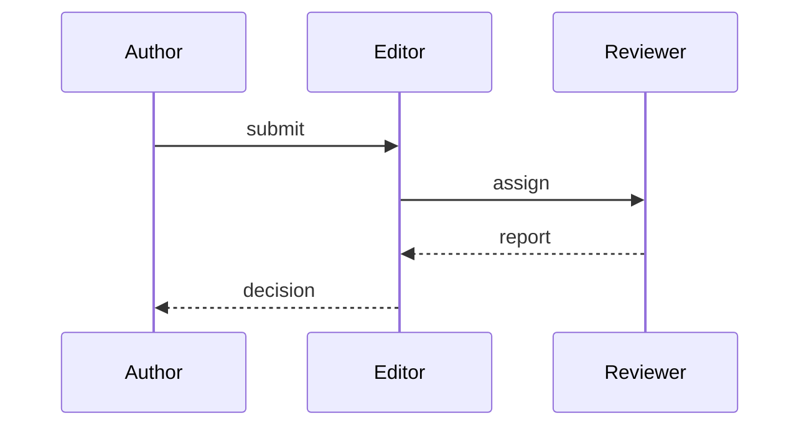

# Reviewer replies

## R2, point 4

R2 asks whether the routing mask transfers across model scales. Table 4 in the appendix now reports 1.3B and 7B results.

## R3, point 1

- [x] Add sliding-window baseline
- [ ] Report variance across 3 seeds

## R1, point 2

R1 wanted the review loop written out. Kept as source: Folio draws flowcharts and state
diagrams, and says so when it cannot draw a kind.

