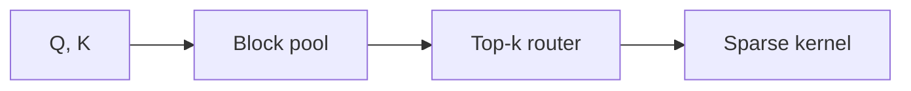

# Sparse attention under bounded compute

## 1 Introduction

Dense attention costs grow quadratically with sequence length, which puts long-context inference out of reach for the compute budgets most labs actually have. We ask a narrower question than prior work: given a fixed FLOP budget *B*, which sparsity pattern recovers the most of dense attention's recall?

Our answer is a block-sparse router trained jointly with the backbone. It reaches 98.4% of dense recall at 31% of the FLOPs on the [RULER](https://example.com/ruler) suite[^12], and holds at 128k tokens.

$$
A(Q, K, V) = \text{softmax}( (Q K^\top \odot M_\theta) / \sqrt{d} ) V, \; \|M_\theta\|_0 \leq B
$$

### 1.1 Motivation

The routing mask `M_θ` is the only learned component, so the kernel below drops into an existing stack without retraining the backbone.

```python:router.py
def route(q, k, budget):
    scores = block_pool(q) @ block_pool(k).T
    topk = scores.topk(budget, dim=-1).indices
    # mask is binary — no straight-through needed
    return scatter_ones(topk, scores.shape)
```

### 1.2 Contributions

- A learned block-sparse routing mask under an explicit FLOP budget
- A fused kernel that adds under 2% end-to-end latency
- Recall parity ablations from 8k to 128k tokens

## 2 Method

Routing happens once per layer, before the attention kernel is dispatched. The pooled scores are cheap enough that the router adds under 2% to end-to-end latency.

### 2.1 Block-sparse routing



| Method | FLOPs | Recall@128k | tok/s |
| --- | ---: | ---: | ---: |
| Dense | 1.00× | 100.0 | 412 |
| Sliding window | 0.22× | 71.3 | 1,640 |
| **Ours (learned)** | **0.31×** | **98.4** | **1,190** |

> The router is trained with a straight-through estimator on the pooled scores; the mask itself is binary at inference.

#### Complexity bound

Sparsity of the routing mask bounds the number of loaded key blocks by B, giving O(nB) work per head.

$$
W(n) \leq n \cdot B \cdot d
$$

### 2.2 Kernel design

The kernel fuses routing and attention into one launch:

```swift
func dispatch(_ q: Tensor, _ k: Tensor, budget: Int) -> Tensor {
    let mask = router.route(q, k, budget: budget)  // binary block mask
    return sparseAttention(q, k, mask: mask)
}
```

## 3 Experiments

### 3.1 Long-context recall

Recall holds within 1.6 points of dense attention across every context length we tested.

- [x] RULER at 8k, 32k, 128k
- [x] Needle-in-haystack sweeps
- [ ] Multi-hop retrieval ablation

### 3.2 Throughput

Throughput improves 2.9× at 128k tokens against the dense baseline on a single H100.

## 4 Limitations

The router assumes block-aligned keys; ragged batching costs an extra gather. See [Kernel notes](../Method/Kernel%20notes.md) for the dispatch details.

## References

[^12]: RULER: What's the Real Context Size of Your Long-Context Language Models? 2024.
