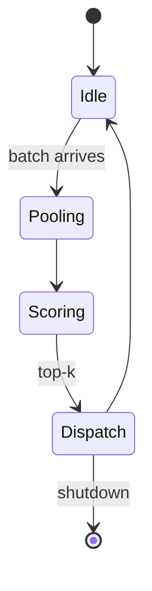

# Block-sparse routing

Routing happens once per layer. The routing mask M_θ is the only learned component, so the kernel drops into an existing stack without retraining.

## Notes

- Budget is expressed in key blocks, not tokens
- The mask transfers across model scales (see reviewer replies)

## Router lifecycle

The router is a small state machine. It scores once per layer and then hands the mask to the
kernel; a shutdown between batches is the only way out.

